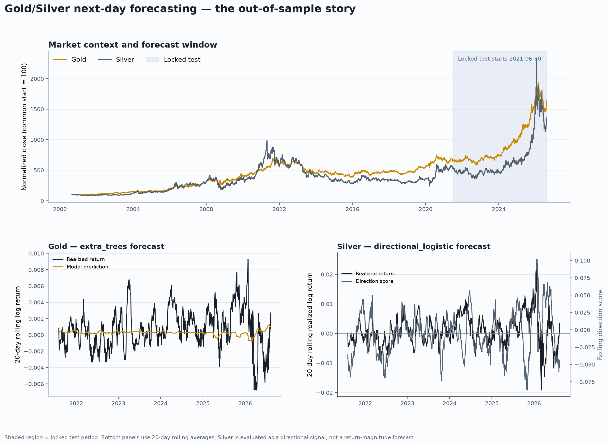

# Gold & Silver Forecasting

<p align="center">
  
  
</p>

<p align="center"><em>Two models, two metals, one reproducible forecasting protocol.</em></p>

Research-grade, reproducible machine learning for one-day-ahead Gold (`GC=F`) and Silver (`SI=F`) futures. The repository compares causal feature models with Chronos-2 and TimesFM 2.5 under the same walk-forward splits, horizon and transaction costs.

> **Research only.** Historical backtests are not investment advice, a trading recommendation or a guarantee of future performance.

[](tests/)
[](pyproject.toml)
[](LICENSE)
[](https://huggingface.co/AurelPx/gold-next-day-returns-extratrees)
[](https://huggingface.co/AurelPx/silver-next-day-direction-logistic)

## Results at a glance

The final 20% of the common history is a locked test set: 970 daily observations, one-day horizon and 10 bps charged per unit of turnover. Models were selected only on the earlier expanding walk-forward validation folds.

| Asset | Selected model | Validation net Sharpe | Locked-test net Sharpe | Test return | Max drawdown |
|---|---|---:|---:|---:|---:|
| Gold | ExtraTrees | **0.618** | **1.187** | **+125.0%** | -22.6% |
| Silver | Directional Logistic Regression | **1.451** | **1.315** | **+545.6%** | -44.4% |

**What this means:** in the repository's identical trading backtest, the selected local models outperform every tested foundation track on net Sharpe for both metals. This is a strategy-performance result within this sample—not proof of universal SOTA or future profitability.

## Local models vs. foundation models

| Locked-test net Sharpe | Gold | Silver |
|---|---:|---:|
| Selected local model | **1.187** | **1.315** |
| Chronos-2, univariate | 0.916 | -0.255 |
| Chronos-2, past-only covariates | 0.159 | -0.504 |
| TimesFM 2.5, univariate | 0.551 | -0.038 |
| TimesFM 2.5, causal covariates | 0.279 | 0.409 |

### The important nuance

- **Trading objective:** our selected models win on net Sharpe after costs for Gold and Silver.
- **Forecast-loss objective:** Gold also has lower squared error than all four foundation tracks, but the paired differences do not survive Holm correction. Silver has lower foundation-model squared error, while the directional local model achieves the stronger signed trading result.
- **Statistical guardrail:** the candidate-aware White Reality Check gives `p=0.106` for Gold and `p=0.042` for Silver across 18 candidates. This adjusts for searching across many models; it is not a guarantee that the edge persists.

**Net Sharpe** is risk-adjusted return after transaction costs. **Squared error** measures numerical forecast accuracy. A model can be better at predicting small return magnitudes yet worse when its signal is converted into a long/short position.


The bars use the same dates, horizon and cost rule. Local and foundation models are compared transparently, while the foundation models receive their own stated univariate or causal-covariate inputs.

## What the pipeline does

- Downloads and caches Yahoo Finance data for Gold and Silver, with optional macro and market covariates.
- Normalizes timestamps, checks missingness and common dates, and records a source manifest with checksums.
- Builds strictly causal features: lags, momentum, rolling volatility, moving-average gaps, drawdown, volume, Gold/Silver ratio, spreads, rolling correlations and cross-asset returns.
- Predicts `log(close[t+1] / close[t])` for Gold and Silver; Silver's final selected model is optimized for directional trading.
- Searches models with expanding walk-forward folds and `gap=1`; no random shuffle is used.
- Backtests positions in `{-1, 0, +1}` with explicit turnover costs.
- Runs robustness checks: bootstrap intervals, regime splits, Diebold-Mariano paired tests, Holm correction and White Reality Check.



The upper panel gives price context and marks the untouched test period. The lower panels show the Gold return forecast and the Silver directional score.


These diagnostics show why the result must be interpreted cautiously: daily return forecasts are noisy even when their signs produce a useful historical strategy.


Rolling-origin results and the candidate-aware bootstrap make regime dependence and model-selection uncertainty visible.

More concise explanations of the figures and technical terms are available in [`docs/figure_guide.md`](docs/figure_guide.md) and [`docs/glossary.md`](docs/glossary.md).

## Hugging Face models

The selected estimators are packaged as separate, private-by-default model repositories:

- [Gold — `AurelPx/gold-next-day-returns-extratrees`](https://huggingface.co/AurelPx/gold-next-day-returns-extratrees)
- [Silver — `AurelPx/silver-next-day-direction-logistic`](https://huggingface.co/AurelPx/silver-next-day-direction-logistic)

Each card contains the estimator, feature schema, configuration, metrics, inference requirements and the full foundation-model audit. The payloads do not include raw Yahoo/FRED data or external foundation-model weights.

## Reproduce

```bash
/opt/homebrew/bin/python3.11 -m venv .venv
source .venv/bin/activate
python -m pip install -e '.[dev,research]'
unzip -o data/raw/market_data.parquet.zip -d data/raw/

make analysis
make train
make global-benchmark
make robustness
make figures
python scripts/export_hf.py --asset all --output hf_export
```

Foundation-model benchmarking is optional and requires the extra dependencies and local checkpoint paths described in [`docs/benchmark_review.md`](docs/benchmark_review.md). Large weights remain outside Git.

## Repository map

- `src/gold_silver/` — data, causal features, models, validation, backtesting and inference.
- `scripts/` — download, train, benchmark, statistical tests, figures and HF export.
- `notebooks/` — exploration, correlations, model benchmark and final selection.
- `tests/` — temporal leakage, causal-feature, model and statistical helper tests.
- `docs/` — benchmark boundary, glossary, figure guide and Hugging Face card patterns.

## Scope and limitations

This is a controlled research comparison, not a claim against every published architecture, feature set, market period or execution environment. Yahoo Finance data can change; transaction costs, slippage, liquidity and market impact are simplified. The repository reports both positive findings and uncertainty so the result can be reproduced and challenged.
