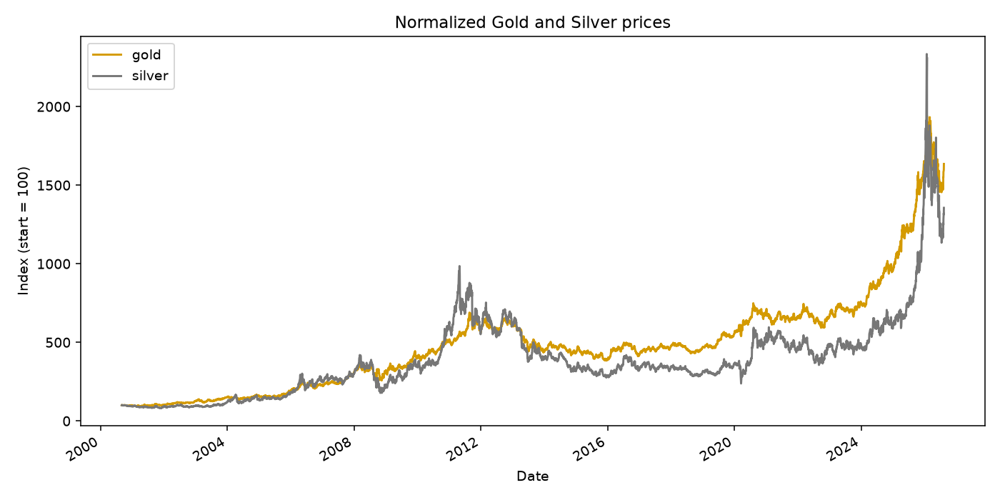
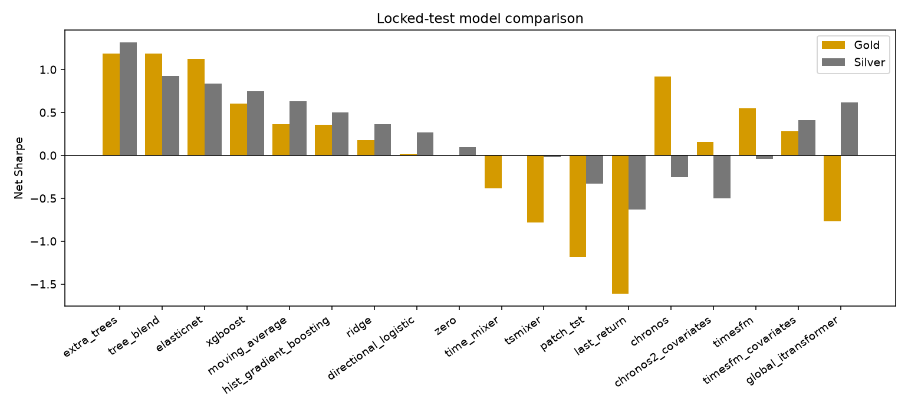
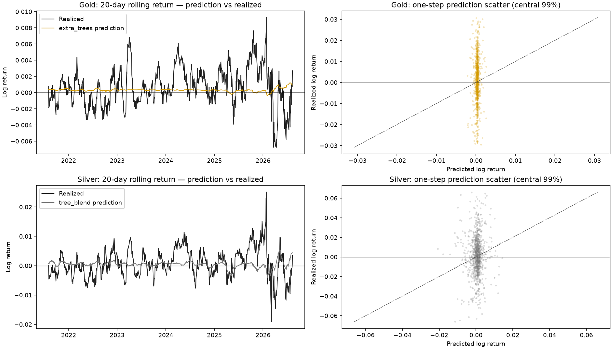
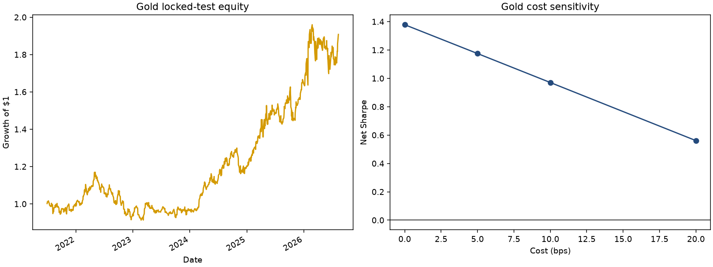
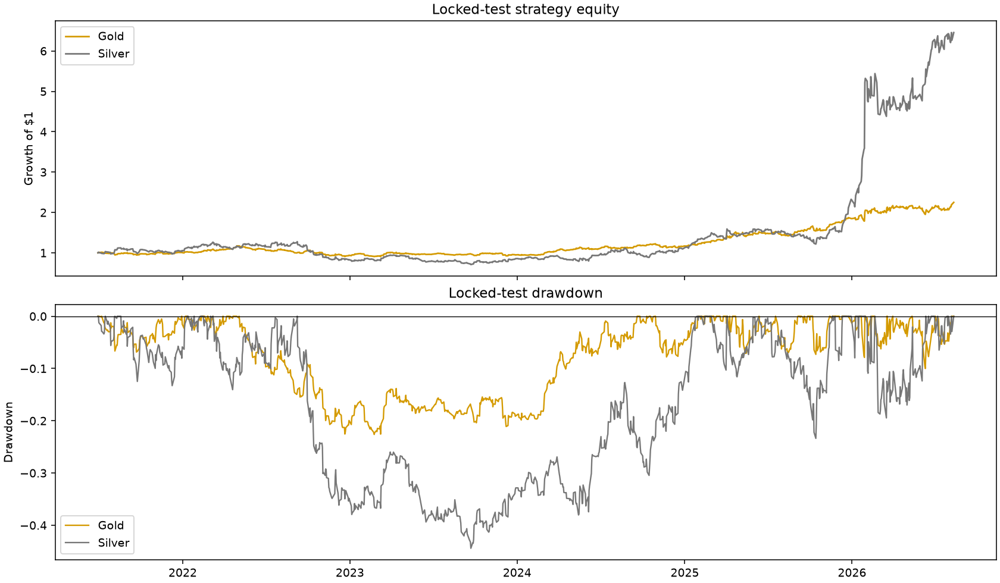
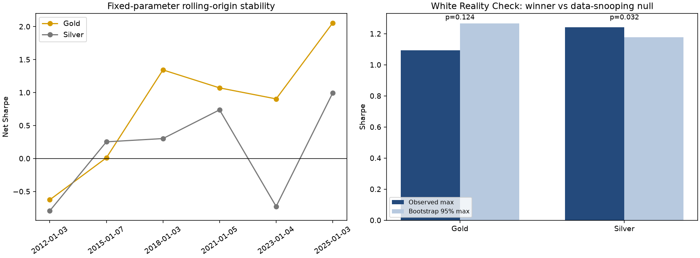

# Gold/Silver Forecasting

Reproducible research for next-day (`J+1`) Gold and Silver log-return forecasting on macOS Apple Silicon. This repository is for research only and is not financial advice.

## What is included

- Strict chronological feature construction with leakage tests.
- Separate Gold and Silver models with a locked final test period.
- Tabular models: Ridge, ElasticNet, directional Logistic Regression, ExtraTrees and HistGradientBoosting.
- Lightweight causal TSMixer, PatchTST-style and TimeMixer-style models for local CPU/MPS experiments.
- Optional real foundation-model adapters for Chronos-Bolt Tiny and TimesFM 2.5.
- Walk-forward model selection, transaction-cost backtests, Diebold–Mariano tests, block bootstrap and Holm–Bonferroni correction.
- English notebooks with executable plots and a small set of tracked report figures.
- GitHub Actions tests on macOS 14 / Python 3.11.

## Installation

```bash
/opt/homebrew/bin/python3.11 -m venv .venv
source .venv/bin/activate
python -m pip install --upgrade pip
python -m pip install -e '.[dev]'
```

Optional research dependencies:

```bash
python -m pip install -e '.[research]'
```

Optional foundation models:

```bash
python -m pip install -e '.[foundation]'
hf auth login
```

The base install intentionally excludes XGBoost, FRED, Optuna, Matplotlib, Seaborn and Jupyter. Install `.[research]` only when those workflows are needed.

## Reproducible data snapshot

A compressed research snapshot is included at `data/raw/market_data.parquet.zip`. Extract it before running the notebooks:

```bash
unzip -o data/raw/market_data.parquet.zip -d data/raw/
```

The snapshot contains the downloaded Yahoo Finance market data used in the current analysis. `data/raw/manifest.json` records sources, dates, columns and checksums. To download a fresh snapshot instead:

```bash
make download
```

Raw Parquet files, processed results, trained bundles, checkpoints and caches remain ignored by Git. Only the compressed snapshot and its manifest are tracked.

## Workflow

```bash
make analysis
make train
make global-benchmark
make predict
```

For the foundation-model benchmark using local checkpoints:

```bash
python scripts/train.py \
  --include-foundation-models \
  --chronos-path /path/to/chronos-bolt-tiny \
  --timesfm-path /path/to/timesfm-2.5-200m-pytorch
```

The checkpoint adapters follow the official [Chronos implementation](https://github.com/amazon-science/chronos-forecasting) and [TimesFM implementation](https://github.com/google-research/timesfm). Never commit Hugging Face tokens or model weights.

To refresh only the optional foundation comparison without rerunning every local model:

```bash
GOLD_SILVER_CHRONOS_PATH=/path/to/chronos-bolt-tiny \
GOLD_SILVER_TIMESFM_PATH=/path/to/timesfm-2.5-200m-pytorch \
make foundation-benchmark
```

## Method and plain-language glossary

- Targets: `log(close[t+1] / close[t])` for each asset.
- Features: lagged returns, momentum, rolling volatility, moving averages, drawdown, volume, Gold/Silver ratio, rolling correlations, cross-asset returns and market covariates.
- Split: final 20% locked as test; one feature row is discarded as a target buffer; the first 80% is searched with five expanding walk-forward folds and `gap=1`.
- Selection metric: mean annualized net Sharpe on validation, with turnover costs of 10 bps per unit turnover.
- Signals: `-1`, `0` or `+1`, applied to the next realized return.
- Statistical checks: one-step squared-error Diebold–Mariano tests, paired moving-block bootstrap for Sharpe differences and Holm–Bonferroni correction across competitors.

Terms used in the reports:

- **Log return** : `log(close[t+1] / close[t])` measures the proportional price change and adds cleanly across days. The model sees the return realized after the feature date, while the backtest converts it to the exact simple return `exp(log_return) - 1` before compounding.
- **OHLC features** : Open, High, Low and Close summarize the completed trading session. Intraday range, close location and overnight gap are available at the end of date `t`; missing historical fields receive a neutral value plus an availability flag.
- **Pearson correlation** : Linear co-movement between two series. A high value is descriptive and can arise from common trends, so it is not evidence that one metal causes the other.
- **Spearman correlation** : Rank-based co-movement, less sensitive to outliers and nonlinear scale. Agreement with Pearson suggests a stable monotonic relationship, not necessarily a trading edge.
- **Rolling correlation** : Correlation recomputed over a moving window, here 20, 60 or 252 observations. It shows regime changes rather than one number averaged over the whole history.
- **Lead/lag correlation** : Gold returns are compared with Silver returns shifted by several days. A peak at lag zero is contemporaneous association; a small nonzero peak is not sufficient evidence of tradable predictability.
- **Walk-forward validation** : Each fold trains on earlier dates and validates on later dates. This approximates deployment and prevents random shuffling from leaking future regimes into training.
- **Locked test** : The final 20% of dates is held untouched while features, models and hyperparameters are selected. It is the only period used for the final out-of-sample claim.
- **Sharpe ratio** : Average net daily strategy return divided by its volatility, annualized by `sqrt(252)`. It rewards return per unit of risk but is unstable in finite samples and is not a guarantee.
- **Turnover and costs** : Turnover is the absolute change in position; each unit costs 10 basis points in the reference backtest. This prevents a high-frequency signal from looking attractive only before implementation costs.
- **Bootstrap interval** : A moving-block resampling interval for the Sharpe difference. Blocks preserve short-run dependence, but the interval remains descriptive rather than a proof of future performance.
- **Diebold–Mariano test** : A paired test of forecast-loss differences on the same dates. The implementation uses a Newey–West variance estimate for short-memory dependence; it tests accuracy, not profitability by itself.
- **Holm–Bonferroni correction** : Adjusts p-values when many competitors are compared. It reduces false discoveries and makes a “significant winner” claim harder to obtain.
- **White Reality Check** : Re-samples all candidate strategy returns together and recomputes the maximum Sharpe each time. It asks whether the best-looking model could have appeared by selecting the winner from many noisy candidates.
- **Rolling-origin stability** : Refits the selected fixed-parameter model before several historical one-year windows. It is a fragility diagnostic; because parameters were selected once on the full development period, it is not a replacement for nested out-of-sample selection.
- **Directional classifier** : Learns whether the next return is positive or negative instead of fitting its exact magnitude. It returns a centered probability score because the trading rule ultimately uses the forecast sign.
- **IC (information coefficient)** : Correlation between a forecast and the realized return. It measures directional or ranking information, not the size of a profitable portfolio after costs.
- **Sortino ratio** : Sharpe-like risk-adjusted return that divides by downside volatility only. It should be read together with drawdown and uncertainty because it can be unstable in short samples.
- **Maximum drawdown** : Largest peak-to-trough fall in the compounded equity curve. It describes loss severity and recovery risk rather than forecast accuracy.
- **Calmar ratio** : Annualized return divided by absolute maximum drawdown. It combines growth and drawdown control, but is unstable over short samples.
- **p-value** : Probability, under a specified null model, of seeing a result at least this extreme. It is not the probability that a model is true or will remain profitable.
- **SOTA** : State of the art means the strongest result within a clearly defined, reproducible comparison set. It is not a universal claim about every model in the literature.
- **Foundation model** : A large pretrained time-series model reused for a new series, often without local fine-tuning. Its checkpoint and input information must be documented before comparison.
- **Global model** : One model predicts multiple assets jointly and can share cross-asset information. It is attractive when the assets have stable common structure, but can underperform separate models when their regimes differ.
- **iTransformer** : An inverted Transformer that embeds each variable’s temporal history as a token and applies attention across variables. Our implementation is a compact two-output research benchmark, not the full published training recipe.
- **MPS** : Apple’s Metal Performance Shaders backend for PyTorch. It may accelerate compatible neural layers on Apple Silicon, while CPU remains the reproducible fallback.
- **Regime analysis** : Splits the locked test into up/down, high/low-volatility and calendar-year groups. These labels are descriptive after the fact and must not be used to tune the deployed signal.
- **PatchTST** : A Transformer that converts temporal patches into tokens and models them with shared channel weights; the local implementation is intentionally compact for Apple Silicon.
- **TimeMixer** : A multiscale MLP architecture that mixes fine and coarse temporal patterns; the local implementation is a lightweight research approximation, not the full paper code.
- **Chronos and TimesFM** : Pretrained time-series foundation models used here as zero-shot univariate baselines. They are evaluated on the same dates and costs, but they do not receive the engineered cross-asset features.

For a one- or two-line explanation of every tracked figure and notebook panel, see the [figure guide](docs/figure_guide.md).

## Current benchmark

The current cache uses five walk-forward folds, a one-day horizon and 10 bps costs.

| Asset | Validation winner | Validation Sharpe | Locked-test Sharpe | Test cumulative return |
|---|---|---:|---:|---:|
| Gold | XGBoost | 0.497 | 0.605 | +46.2% |
| Silver | Directional Logistic Regression | 1.211 | 1.242 | +472.1% |

Gold test comparison:

| Model | Net Sharpe |
|---|---:|
| ExtraTrees | 1.093 |
| XGBoost (selected by validation) | 0.605 |
| Directional Logistic Regression | 0.414 |
| Global iTransformer (rejected by validation) | -0.765 |
| TimesFM 2.5 | 0.551 |
| HistGradientBoosting | 0.357 |
| Tree blend | 0.269 |
| Chronos-Bolt Tiny | -0.412 |
| TimeMixer-style | -0.387 |
| PatchTST-style | -1.190 |

ExtraTrees has the highest locked-test Gold Sharpe, but XGBoost is selected because it won validation. After Newey–West Diebold–Mariano testing, Holm correction and the White Reality Check, neither result is statistically strong enough to claim universal SOTA.

Silver test comparison:

| Model | Net Sharpe |
|---|---:|
| Directional Logistic Regression (selected by validation) | 1.242 |
| Ridge | 1.052 |
| ExtraTrees | 0.924 |
| HistGradientBoosting | 0.904 |
| ElasticNet | 0.886 |
| XGBoost | 0.738 |
| Tree blend | 0.630 |
| Global iTransformer (rejected by validation) | 0.619 |
| TimesFM 2.5 | -0.038 |
| Chronos-Bolt Tiny | -0.269 |

The directional Silver model is selected from validation and improves the locked-test Sharpe from `0.904` to `1.242` relative to the previous HistGradientBoosting winner. The higher Gold ExtraTrees test Sharpe is still not selected after the fact: every model decision is made from validation only.

Silver remains cost-sensitive: its Sharpe falls from `1.242` at 10 bps to `0.695` at 20 bps, while fixed-parameter rolling-origin Sharpes range from `−0.794` to `0.994`. The signal is therefore promising but regime-sensitive and turnover-heavy, not deployment-ready.

We tested two shared models. Multi-output ExtraTrees reached validation Sharpe `0.323` for Gold and `−0.571` for Silver; the compact global iTransformer reached `−0.443` and `−0.961`, with a joint validation Sharpe of `−0.702`. Both are rejected by the same validation rule, so the project keeps separate Gold and Silver models rather than forcing a shared architecture.

On the locked dates, the paired comparison gives a Gold DM p-value of `0.057` and a Silver p-value below `10⁻⁶⁷`. Gold’s local model has slightly lower squared error; Silver’s global model has lower squared error, yet the local strategy still has higher net Sharpe by `0.623`. This shows why forecast loss and tradable performance must both be reported, not a universal theorem about global architectures.

The foundation-model comparison is deliberately separate because Chronos and TimesFM receive only the univariate return history, while local tabular models receive engineered OHLC and cross-asset features. Both foundation models are nevertheless evaluated on the same 970 locked-test dates, one-day horizon and 10 bps costs.

The White Reality Check p-values are 0.131 for Gold and 0.035 for Silver across 14 local candidates, including the directional and global models. Silver clears this particular 5% candidate-aware null, but its rolling-origin results still include negative historical windows and the external architecture comparison is not exhaustive; this is evidence for continued research, not a universal SOTA or financial-deployment claim.

### Architecture review

- **PatchTST** uses temporal patches as Transformer tokens and shared channel weights; our compact implementation tests the inductive bias locally, but it is not the full published training recipe. See the [original PatchTST paper](https://arxiv.org/abs/2211.14730).
- **TimeMixer** separates fine and coarse temporal scales with MLP mixing; our version is a Mac-sized approximation of its multiscale idea. See the [TimeMixer paper](https://arxiv.org/abs/2405.14616).
- **SAMformer** adds sharpness-aware optimization to a Transformer and is a stronger candidate for a future experiment, but its published benchmarks target long-horizon datasets rather than this one-day financial-return task. See [SAMformer](https://arxiv.org/abs/2402.10198).
- **Chronos-2** extends foundation forecasting to multivariate and covariate-informed inputs, unlike the univariate Chronos adapter currently used here. It is a logical next benchmark if a local checkpoint and adapter are available. See [Chronos-2](https://arxiv.org/abs/2510.15821).
- **iTransformer** inverts the time/variable layout so attention models dependencies between variable tokens; the new global benchmark applies this idea to the 144 causal feature channels and two metal targets. See the [iTransformer paper](https://arxiv.org/abs/2310.06625).
- **Directional Logistic Regression** is not claimed as a universal SOTA architecture; it is a task-aligned candidate because the trading layer ultimately uses only the sign of the forecast. It wins Silver validation in the current data snapshot, while Gold still selects XGBoost.
- A recent financial-return study finds that foundation models can win task rankings while gains over random-walk benchmarks remain sparse; this supports our requirement for equalized windows, costs and multiple-comparison tests. See [Pretrained Time-Series Foundation Models for Financial Return Forecasting](https://arxiv.org/abs/2606.27100).

## Visual research summary



This chart rescales both prices to 100 at the common start date, making co-movement visible despite different dollar prices. The return panel and rolling correlation panel show that similar long-run direction does not imply identical daily returns.



Validation bars show mean net Sharpe over expanding walk-forward folds; test bars are a separate locked-period diagnostic. A positive bar is not enough: stability across folds, costs and uncertainty must also be checked.



These panels compare 20-day rolling predicted and realized returns on dates never used for fitting. The scatter is clipped to the central 99% only for readability; the underlying metrics use every observation.



This figure shows the Gold winner against competitors after multiple-comparison correction. Confidence intervals crossing zero mean the observed advantage is compatible with sampling noise.



The equity curve compounds net returns after turnover costs, while drawdown measures the fall from the previous equity high. A good model should have both acceptable growth and tolerable drawdowns.



The left panel shows how fixed final parameters behave across historical one-year origins; sign changes indicate regime sensitivity. The right panel compares the observed maximum Sharpe with the 95th percentile of a candidate-aware bootstrap null, which is why a high single-period Sharpe is not enough.

## Notebooks

Run them from the repository root after extracting the snapshot:

1. `01_data_and_correlations.ipynb` : coverage, normalized prices, returns and Gold/Silver dependence.
2. `02_feature_quality.ipynb` : missingness, distributions, correlation heatmaps and leakage checks.
3. `03_model_benchmark.ipynb` : validation leaderboard, locked-test comparison and model plots.
4. `04_final_selection.ipynb` : equity curves, costs, bootstrap intervals and corrected statistical tests.

The optional `make joint-benchmark` command reproduces the shared-model probe; it is a diagnostic, not an after-the-fact replacement for the separately selected production candidates.
The `make robustness` command regenerates the Reality Check, regime tables and rolling-origin stability diagnostics.

## Generated artifacts

- `data/processed/*_leaderboard.csv`: validation model search results.
- `data/processed/*_test_comparison.csv`: locked-test metrics for every evaluated family.
- `data/processed/*_foundation_predictions.csv`: optional Chronos/TimesFM forecasts on the same locked dates, used by the expanded Reality Check when available.
- `data/processed/global_model_validation.csv`: shared-model configurations selected using the joint validation Sharpe.
- `data/processed/*_global_predictions.csv`: shared global-model predictions on the locked test dates.
- `data/processed/global_model_statistical_tests.csv`: paired DM and block-bootstrap comparisons of the shared model against each local winner.
- `data/processed/*_statistical_tests.csv`: DM tests, Holm-adjusted p-values and paired Sharpe bootstrap intervals.
- `data/processed/*_reality_check.csv`: candidate-aware White Reality Check against data-snooping.
- `data/processed/*_regime_performance.csv`: descriptive direction, volatility and calendar regime tables.
- `data/processed/*_origin_stability.csv`: fixed-parameter historical rolling-origin diagnostics.
- `reports/experiment_summary.json`: complete run metadata and selected model bundle information.
- `models/gold_silver_bundle.joblib`: local final bundle, ignored by Git.

## Private publication

The GitHub repository is intended to remain private while the research is ongoing. Hugging Face publication is intentionally separate and should contain only a reviewed winner bundle and model card.

Yahoo Finance and FRED data may have usage and redistribution restrictions. The included snapshot is for this private research repository; verify the applicable terms before sharing it.
